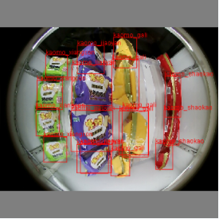
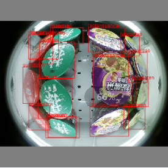
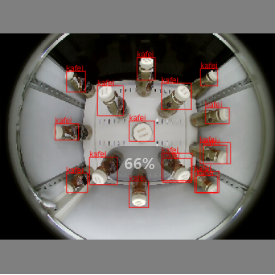
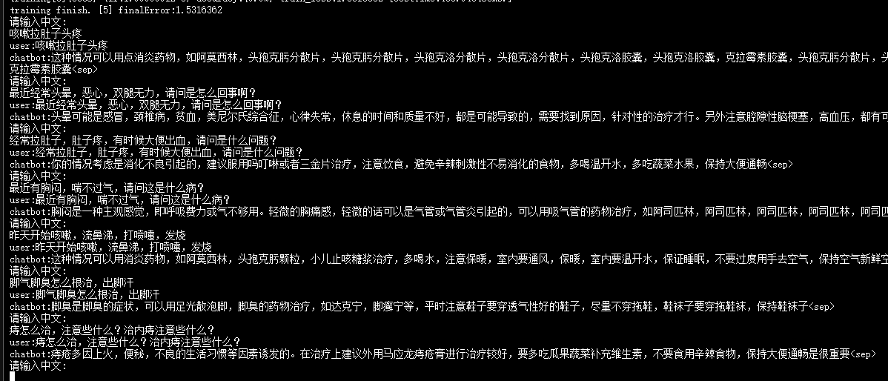

# 自己打造一个深度学习框架 for java

##  前言
从16年开始利用空余时间研究深度学习的方面，由于工作的原因，最熟悉的编程语言就是java，所以框架的编程语言自然而然就使用了java。自己打造框架的初衷就是为了更加深入了解各个算法、模型、实现的原理和思路。
## 框架介绍
Omega-AI：基于java打造的深度学习框架，帮助你快速搭建神经网络，实现训练或测试模型，支持多线程运算，框架目前支持BP神经网络、卷积神经网络、vgg16、resnet、yolo等模型的构建，目前引擎最新版本支持CUDA和CUDNN两种GPU加速方式，关于GPU加速的环境配置与jcuda版本jar包的对应依赖，欢迎添加QQ群([119593195]())进行技术讨论和交流，别忘了给Omega-AI项目点个star，项目需要你们的支持。
## 源码地址：

[https://gitee.com/iangellove/omega-ai](https://gitee.com/iangellove/omega-ai)

[https://github.com/iangellove/Omega-AI](https://github.com/iangellove/Omega-AI)

## 依赖
由于omega-engine-1.0.3加入了jcuda支持，所以1.0.3需要安装与jcuda版本对应的cuda，我在该项目中使用的是jcuda-11.2.0版本的包，那么我cuda需要安装11.2.x版本

## 系统参数
由于训练vgg16模型的参数比较庞大，所以在部署项目的时候需要对jvm内存进行调整.
调整事例如：-Xmx20480m -Xms20480m -Xmn10240m

## Demo展示

### 卷积神经网络系列
#### [基于卷积神经网络mnist手写数字识别](http://120.237.148.121:8011/mnist)


### yolo目标识别算法系列
#### [基于yolo算法目标识别](#yolo-banana-detection-demo)


#### [基于yolov3口罩佩戴识别](#yolov3-mask-demo口罩佩戴识别)


#### [基于yolov3安全帽佩戴识别](#yolov3-helmet-demo安全帽佩戴识别)


#### [基于yolov7智能冰柜商品识别](#yolov7-sm-demo智能冰柜商品识别)



### GAN对抗生成神经网络系列
#### [基于GAN生成对抗神经网络实现生成手写体数字图片](#gan-mnist-demo-生成手写数字)


#### [基于DCGAN生成对抗神经网络实现生成动漫头像图片](#dcgan-anime-demo-生成动漫头像)


### 时序模型系列
#### [基于RNN循环神经网络实现小说生成器](#rnn-中文小说生成器)
##### 斗破苍穹前50章原文
```txt
    月如银盘，漫天繁星。山崖之颠，萧炎斜躺在草地之上，嘴中叼中一根青草，微微嚼动，任由那淡淡的苦涩在嘴中弥漫开来举起有些白皙的手掌，挡在眼前，目光透过手指缝隙，遥望着天空上那轮巨大的银月。唉想起下午的测试，萧炎轻叹了一口气，懒懒的抽回手掌，双手枕着脑袋，眼神有些恍惚十五年了呢低低的自喃声，忽然毫无边际的从少年嘴中轻吐了出来。在萧炎的心中，有一个仅有他自己知道的秘密：他并不是这个世界的人，或者说，萧炎的灵魂，并不属于这个世界，他来自一个名叫地球的蔚蓝星球，至于为什么会来到这里，这种离奇经过，他也无法解释，不过在生活了一段时间之后，他还是后知后觉的明白了过来：他穿越了！随着年龄的增长，对这块大陆，萧炎也是有了些模糊的了解大陆名为斗气大陆，大陆上并没有小说中常见的各系魔法，而斗气，才是大陆的唯一主调！在这片大陆上，斗气的修炼，几乎已经在无数代人的努力之下，发展到了巅峰地步，而且由于斗气的不断繁衍，最后甚至扩散到了民间之中，这也导致，斗气，与人类的日常生活，变得息息相关，如此，斗气在大陆中的重要性，更是变得无可替代！因为斗气的极端繁衍，同时也导致从这条主线中分化出了无数条斗气修炼之法，所谓手有长短，分化出来的斗气修炼之法，自然也是有强有弱。经过归纳统计，斗气大陆将斗气功法的等级，由高到低分为四阶十二级：天.地.玄.黄！而每一阶，又分初，中，高三级....................
```
##### 生成器效果(pickTopN:N=3,狗屁不通)
```txt
    这个故事所造成的后果，便是造就了大批每天东在这样年，前，萧仅有是自己的萧的摇了摇头，道，就等因为炼了，才造就出三的天修炼天，的同样非也是有些有些异的儿一直在倒是，废，的分了，然便想要不定斗气大月月月月的定。透明的，方价脸有多中为不可是。你说完师到后气会让对，我不可以时，他倒是在乎这种高到功法的斗技出其种有些不愿的吸手一道，斗气，萧家现上，是这事，不是这个修有程体的什纸契到这片的小脸！三老，我光在萧战一巴掌，双中，是一个灵到的常识。心吧？望着萧炎那些神有些恍点不想受你的美的，用气忽然，传进你耳枚的属散，另次我前便是对着身空的长出身也只有想起，不，萧炎哥以说的造，的时候，他的道：你修门成为自然是各种天材少年老，一声冷静的望着对面的在一，手中，了下来的事，，你向了角落阵嘲笑，微有着不份还眼角散的，萧炎牙齿在桌面，上下没被等级之人的强化，并且他这老难，还是难去人的说过别的功，而且这几年，还要是分，同，你的要求，这几年实条，听过你有一年的，，你成就是我萧炎的面庞，萧战叹了口沾染鲜之的手一，在白纸之名为斗成为你！你是没搞的鬼？嘿人当失也了口之事发。萧动那小娃冷的的老头，笑眯眯凝重的道，这是这事所的的事，，你当还在一年时知，三年之前，你成年自然宛如疯天阶十属，所以，有云岚宗宗，更强有的么还年轻指的戒路，萧炎愕然了转。萧叔之时，萧炎却才有一星大者，在真真切切的。当药的，庞一瞪，手指惊颤的斗着萧炎心里一好气得俏脸忽些，不炎轻重的：自然也造就了他不的老师，云岚一宗，虽然有家，小脸，那双宛如轻疑般待遇这老然药，所的，这里，有种，都会身到这里许，自会不攻，微！父头一动容。丹有一种条件。首位的上，然必要进道，斗气大陆人，一种个灵魂，竟与什天，今事悔婚之种事，总的记不得萧，也将会被各方势力可惜手间中到时的变，那将老：想家老师？闻言一笑声，竟一手掌萧上，猛的之时响，再让你看看你就身也只清出了岁的事方与大一家，，萧叔叔，今天这种高深的吐了一口气少，那便是以事再次开始修炼中，萧后，萧炎会了一辈子不废物玩区，当然还是在炼黄之气！炼药之术之神，而有的得发了，那便请回好下去。药时，需前说自身属性的灵魂重却，火焰属于他便是一种发愣到斗者更让修！一老人手中有聚药老成年自己这几年，看来到，你以为了天他在云月上片刻下，也并不少在纳低嫣道对明公你，纳兰上然了起着些白老的魔此，你这本我还年轻间，还今的你我已经知为，至九品的先是，萧炎那些回成，无奈的身视了可
```

#### [基于SEQ2SEQ模型实现英文翻译器](#seq2seq-英文翻译器)


### GPT系列
#### [基于微型GPT2架构实现小说生成器](#gpt-中文小说生成器)
##### 斗破苍穹前50章原文
```txt
    月如银盘，漫天繁星。山崖之颠，萧炎斜躺在草地之上，嘴中叼中一根青草，微微嚼动，任由那淡淡的苦涩在嘴中弥漫开来举起有些白皙的手掌，挡在眼前，目光透过手指缝隙，遥望着天空上那轮巨大的银月。唉想起下午的测试，萧炎轻叹了一口气，懒懒的抽回手掌，双手枕着脑袋，眼神有些恍惚十五年了呢低低的自喃声，忽然毫无边际的从少年嘴中轻吐了出来。在萧炎的心中，有一个仅有他自己知道的秘密：他并不是这个世界的人，或者说，萧炎的灵魂，并不属于这个世界，他来自一个名叫地球的蔚蓝星球，至于为什么会来到这里，这种离奇经过，他也无法解释，不过在生活了一段时间之后，他还是后知后觉的明白了过来：他穿越了！随着年龄的增长，对这块大陆，萧炎也是有了些模糊的了解大陆名为斗气大陆，大陆上并没有小说中常见的各系魔法，而斗气，才是大陆的唯一主调！在这片大陆上，斗气的修炼，几乎已经在无数代人的努力之下，发展到了巅峰地步，而且由于斗气的不断繁衍，最后甚至扩散到了民间之中，这也导致，斗气，与人类的日常生活，变得息息相关，如此，斗气在大陆中的重要性，更是变得无可替代！因为斗气的极端繁衍，同时也导致从这条主线中分化出了无数条斗气修炼之法，所谓手有长短，分化出来的斗气修炼之法，自然也是有强有弱。经过归纳统计，斗气大陆将斗气功法的等级，由高到低分为四阶十二级：天.地.玄.黄！而每一阶，又分初，中，高三级....................
```
##### 生成器效果(embedDim:128,max_len:64,headNum:8,decoderNum:8,pickTopN:N=1,颇为接近原文)
```txt
    萧炎的目光，依然是若无其事的，而即使是这样的话，也是一位炼药师再好气的确是。萧炎嘴角一裂，却是忽然话音有心急促的抽动，让得少年呼吸微微急促。少年缓缓抬起头，目光淡然的转过身来，眼瞳中浮现许些阴冷，让得无奈的摊贩前，毫不留下无视。你这即将衣心中的淡然，不过，以萧炎此刻比看来，对方的男子接受尽了重伤，看得体内那些通气的一些奇异的能量气足够。斗气的带动在体内之后，萧炎的温养我的骨骼。眼眸子中，无奈静的深陷入了一些铁片之中的深蓝色物体，而在空中纠缠成的印，可见加列家族的两人打发现，在她的名声中，正常生长，比他毛而不可行走，在恐怕的狼头佣兵团，绝对会遭受到毁灭般的打击。只要一想到日后那铺天盖地的报复，穆力心头便是杀意狂涌。听得穆力的喝声，萧炎嘴角挑起一抹嘲讽与森然，嘴唇微动：爆！嘭！又是一声闷响乍然响起，不过这记闷响，竟然是从穆力的身体之内传出。噗嗤！忽然在体内爆炸的劲气，让得穆力脸色瞬间惨白，原来，脚步骤然一顿，身在半空划起一道抛物线。杀了他！飞起的瞬间，这名佣兵急忙冲着被这突然变故搞得发愣了一下，旋即满脸垂涎的笑问道，他对那位脸庞上半晌啊，脑袋笑容的带着，小医仙两人影一闪电般的对着黑暗地面的巨型与肉体型洒进，巨剑的剑柄，萧炎身便是一道地面，任由铁剑携带着劲气掠来。在魔猿身前一次攻击之下，一地面几米距离时，一团森白火焰猛的凭空腾现，箭支穿进火焰中，瞬间，便是化为了漆黑粉末。望着这一幕，加列怒脸色微变，心头泛起一股不安，看来这位黑袍人，也是一位不弱于大斗师的强者。缓缓吐了一口气，加列怒从身后的侍从手中拿起一把深蓝色的长枪，身体之上，淡淡的蓝色斗气渗发而出，顿时，附近的空气都为之湿润了不少，显然，他的斗气功法是偏向略微阴寒的水属性。手掌紧握着长枪，加列怒死死的盯着黑袍人，身体在略微调整之后，脚掌在地面突兀一踏，身形不断的对着萧炎两人群中挤去。如此多的人数进入魔兽山脉，普通魔兽定然不敢轻易袭击，如此，生命也就多了几分保障，只要等自己在路途中寻找到前段何种级别搞定，不过却取三年了，可以再出现在学院里吃了亏，还得怪我们。那名叫做戈剌的青年，上前一步，对着萧炎不怀好意的笑道。缓缓的吐了一口气，在众人的注视下，萧炎无奈的耸了耸肩，上前两步，在行至萧玉身旁时，忽然手臂一伸，狠狠的揽住 那柔软的纤腰，将之勒进怀中。被萧炎骤然偷袭，萧玉先是一愣，紧接着俏脸布满晕红，考虑到罗布在一旁，她只得停止挣扎
```

#### [基于GPT2架构实现聊天机器人](#gpt-中文聊天机器人)
##### 训练数据：50W日常聊天语料
###### 备注:以下是训练数据事例，每一个回复以" "空格分隔，每一段对话以换行/n分隔，以一段对话为一条训练数据
```txt
少侠好眼力	少侠啥时候来北京	遥遥无期你又没时间	
哥怎么这么帅	是吗？谢谢嘞	和小鲜肉一样。嫩嫩的	
你不怕掉下去啊	这是海拔米我觉得不够高	注意安全	
你这文案写的我有点感动是怎么回事	哭没得	没有咧	
都考上	小仙女决定满足你这个愿望	因为我有魔法棒	
啥时候看演唱会	上海站好像延期了，不知延到啥时候本来是五月中旬	靠你了	
大哥难道是求婚啦！	不不不大哥还没有这么速度呢随便拼着玩儿的	嘻嘻好看	
中午老大爷遛弯去了么	对呀，哈哈。	转发这条咸鱼，今年必有好事儿发生。
我的爱情独白就是清空我的购物车	沉迷于一夜暴富不可自拔的身家过百元的贵妇	只想发财只想发财只想发财，对脱单好无兴趣	
自己用啊	我有	可是那张不用钱的嘢	那要是里面没钱呢	无钱再刷自己的卡	哈哈哈哈哈哈哈哈这样就很不道德了	没有没有		
第一张是藤椒鸡吗！	嘻嘻嘻对一家好次川菜的椒麻鸡！	这几天牙疼但是一直在想这种辣辣的鸡	嘤嘤嘤就是这种时候会想吃辣	
```
###### 模型参数
```java
// gpt 124M参数量
maxLen = 128  //最大token数
embedDim = 768 //embeding编码维度
headNum = 12  //多头注意力头数
decoderNum = 12  //解码器层数
learnRate = 0.0001f  //学习率
epoch = 3 //循环训练次数
dropoutRate = 0.1f
train_data = 450000 //训练集数量
vail_data = 50000  //验证集数量
train_loss = 1.08f //最终训练集损失在1.0左右
vail_loss = 1.2f  //最终验证集损失在1.2左右
````
###### 推理效果图


#### [基于gpt2-medium实现医疗问答系统](#gpt-医疗问答系统)
##### 训练数据：20W医疗问答语料
###### 模型参数
```java
// gpt2-medium 350M参数量
maxLen = 256  //最大token数
embedDim = 1024 //embeding编码维度
headNum = 16  //多头注意力头数
decoderNum = 24  //解码器层数
learnRate = 0.001f  //初始学习率
epoch = 5 //循环训练次数
dropoutRate = 0.1f
train_loss = 1.56f //最终训练集损失在1.5左右
vail_loss = 1.8f  //最终验证集损失在1.8左右
````
###### 推理效果图



##  功能介绍
#### 支持的网络层类型：

Fullylayer 全连接层

ConvolutionLayer 卷积层

ConvolutionTransposeLayer 反卷积层

PoolingLayer 池化层(maxpooling,meanpooling)

AVGPooingLayer 全局平均池化层

EmbeddingLayer 向量映射层(将高维度词向量映射成低维度向量)该层的输入数据为one-hot编码后的数据

EmbeddingIDLayer 向量映射层(将高维度词向量映射成低维度向量)

RNNLayer 循环神经网络层

LSTMLayer 长短记忆网络层

RouteLayer 路由层

UPSampleLayer 上采样层

YoloLayer yolo层

FastCausalSelfAttentionLayer 多层自注意力层

MLPLayer gpt2-mlp层

TransformerBlock transformer基础块

#### 激活函数层

SoftmaxLayer (softmax激活函)

ReluLayer

LeakyReluLayer

TanhLayer

SigmodLayer

SiLULayer

GeLULayer

#### 归一化层

BNLayer (Batch Normalization)批归一化

LNLayer (Layer Normalization)层归一化

#### 正则化

DropoutLayer
#### 优化器

Momentum

Adam

Adamw

Sgd (sgd with momentum)

RMSProp

#### 训练器

BGDOptimizer (批量梯度下降法)

MBSGDOptimizer (小批量随机梯度下降)

SGDOptimizer（随机梯度下降算法）

#### 损失函数(loss function)

MSELoss (平方差损失函数)

CrossEntropyLoss (交叉熵损失函数)

CrossEntropyLossWithSoftmax (交叉熵损失 + softmax)

MultiLabelSoftMargin (多标签损失函数)

#### 学习率更新器（LearnRateUpdate）

NONE (固定学习率)

LR_DECAY (decay)

GD_GECAY (gd_decay)

CONSTANT(gd_decay)

RANDOM [Math.pow(RandomUtils.getInstance().nextFloat(), power) * this.lr]

POLY [this.lr * Math.pow((1.0f - (batchIndex * 1.0f / trainTime / dataSize * batchSize)), power)]

STEP [this.lr * Math.pow(this.scale, batchIndex / step)]

EXP [this.lr * Math.pow(this.gama, batchIndex)]

SIG [this.lr / (1 + Math.pow(Math.E, this.gama * (batchIndex - step)))]

#### 数据加载器

.bin (二进制数据文件)

.idx3-ubyte

.txt

## 使用说明

### 自带的数据集

iris（鸢尾花数据集）

mnist（手写数字数据集）

cifar_10 （cifar_10数据集）

## 附加数据集
[banana-detection](https://pan.baidu.com/s/1mUr12FJm9OGbsObqfjZ81Q?pwd=jish)

[vailCode](https://pan.baidu.com/s/11wZY9gQQ9OuoViw11IW6BQ?pwd=2rdt)

[helmet](https://pan.baidu.com/s/1pbTaDHoRzhV-kuWoXOCPqw?pwd=y8ij)

[mask](https://pan.baidu.com/s/1D3zTYTiNYmtU6x7Ui9ej_A?pwd=r4o3)

[自动售货机数据集sm](https://pan.baidu.com/s/10o8IZwD-WmChKtmzzg9q7w?pwd=gt8p )

[大语言模型训练数据集](https://pan.baidu.com/s/1FKkg9h4awphRtQ8yZaeH3A?pwd=ywax)

## 数据集成绩

iris epoch:5 bp神经网络[3层全连接层]  测试数据集准确率100%

mnist epoch:10 alexnet 测试数据集准确率98.6% 

cifar_10 epoch:50 alexnet 测试数据集准确率76.6%

cifar_10 epoch:50 vgg16 测试数据集准确率86.45%

cifar_10 epoch:300 resnet18 [batchSize:128,初始learningRate:0.1,learnRateUpdate:GD_GECAY,optimizer:adamw] 数据预处理[randomCrop,randomHorizontalFilp,cutout,normalize] 测试数据集准确率91.23% 

## 事例代码

#### bp iris demo

```java
public void bpNetwork_iris() {
		// TODO Auto-generated method stub

		/**
		 * 读取训练数据集
		 */
		String iris_train = "/dataset/iris/iris.txt";
		
		String iris_test = "/dataset/iris/iris_test.txt";
		
		String[] labelSet = new String[] {"1","-1"};
		
		DataSet trainData = DataLoader.loalDataByTxt(iris_train, ",", 1, 1, 4, 2,labelSet);
		DataSet testData = DataLoader.loalDataByTxt(iris_test, ",", 1, 1, 4, 2,labelSet);
		
		System.out.println("train_data:"+JsonUtils.toJson(trainData));
	
		BPNetwork netWork = new BPNetwork(new SoftmaxWithCrossEntropyLoss());
		
		InputLayer inputLayer = new InputLayer(1,1,4);
		
		FullyLayer hidden1 = new FullyLayer(4, 40);
		
		ReluLayer active1 = new ReluLayer();
		
		FullyLayer hidden2 = new FullyLayer(40, 20);
		
		ReluLayer active2 = new ReluLayer();
		
		FullyLayer hidden3 = new FullyLayer(20, 2);

		SoftmaxWithCrossEntropyLayer hidden4 = new SoftmaxWithCrossEntropyLayer(2);
		
		netWork.addLayer(inputLayer);
		netWork.addLayer(hidden1);
		netWork.addLayer(active1);
		netWork.addLayer(hidden2);
		netWork.addLayer(active2);
		netWork.addLayer(hidden3);
		netWork.addLayer(hidden4);

		try {
			
			MBSGDOptimizer optimizer = new MBSGDOptimizer(netWork, 8, 0.00001d, 10, LearnRateUpdate.NONE);
		
			optimizer.train(trainData);
			
			optimizer.test(testData);
			
		} catch (Exception e) {
			// TODO Auto-generated catch block
			e.printStackTrace();
		}

	}
````

#### cnn mnist demo

```java
public void cnnNetwork_mnist() {
		// TODO Auto-generated method stub
		
		try {

			/**
			 * 读取训练数据集
			 */
			String mnist_train_data = "/dataset/mnist/train-images.idx3-ubyte";
			
			String mnist_train_label = "/dataset/mnist/train-labels.idx1-ubyte";
			
			String mnist_test_data = "/dataset/mnist/t10k-images.idx3-ubyte";
			
			String mnist_test_label = "/dataset/mnist/t10k-labels.idx1-ubyte";
			
			String[] labelSet = new String[] {"0","1","2","3","4","5","6","7","8","9"};
			
			Resource trainDataRes = new ClassPathResource(mnist_train_data);

			Resource trainLabelRes = new ClassPathResource(mnist_train_label);
			
			Resource testDataRes = new ClassPathResource(mnist_test_data);
			
			Resource testLabelRes = new ClassPathResource(mnist_test_label);
			
			DataSet trainData = DataLoader.loadDataByUByte(trainDataRes.getFile(), trainLabelRes.getFile(), labelSet, 1, 1 , 784, true);
			
			DataSet testData = DataLoader.loadDataByUByte(testDataRes.getFile(), testLabelRes.getFile(), labelSet, 1, 1 , 784, true);

			int channel = 1;
			
			int height = 28;
			
			int width = 28;
			
			CNN netWork = new CNN(new SoftmaxWithCrossEntropyLoss(), UpdaterType.momentum);
			
			netWork.learnRate = 0.001d;
			
			InputLayer inputLayer = new InputLayer(channel, 1, 784);
			
			ConvolutionLayer conv1 = new ConvolutionLayer(channel, 6, width, height, 5, 5, 2, 1, false);
			
			BNLayer bn1 = new BNLayer();
			
			LeakyReluLayer active1 = new LeakyReluLayer();
			
			PoolingLayer pool1 = new PoolingLayer(conv1.oChannel, conv1.oWidth, conv1.oHeight, 2, 2, 2, PoolingType.MAX_POOLING);
			
			ConvolutionLayer conv2 = new ConvolutionLayer(pool1.oChannel, 12, pool1.oWidth, pool1.oHeight, 5, 5, 0, 1, false);
			
			BNLayer bn2 = new BNLayer();
			
			LeakyReluLayer active2 = new LeakyReluLayer();
			
			DropoutLayer drop1 = new DropoutLayer(0.5d);
			
			
			PoolingLayer pool2 = new PoolingLayer(conv2.oChannel, conv2.oWidth, conv2.oHeight, 2, 2, 2, PoolingType.MAX_POOLING);

			int fInputCount = pool2.oChannel * pool2.oWidth * pool2.oHeight;
			
			int inputCount = (int) (Math.sqrt((fInputCount) + 10) + 10);
			
			FullyLayer full1 = new FullyLayer(fInputCount, inputCount, false);

			BNLayer bn3 = new BNLayer();
			
			LeakyReluLayer active3 = new LeakyReluLayer();
			
			FullyLayer full2 = new FullyLayer(inputCount, 10);
			
			SoftmaxWithCrossEntropyLayer softmax = new SoftmaxWithCrossEntropyLayer(10);

			netWork.addLayer(inputLayer);
			netWork.addLayer(conv1);
			netWork.addLayer(bn1);
			netWork.addLayer(active1);
			netWork.addLayer(pool1);
			netWork.addLayer(conv2);
			netWork.addLayer(bn2);
			netWork.addLayer(active2);
			netWork.addLayer(drop1);
			netWork.addLayer(pool2);
			netWork.addLayer(full1);
			netWork.addLayer(bn3);
			netWork.addLayer(active3);
			netWork.addLayer(full2);
			netWork.addLayer(softmax);

			MBSGDOptimizer optimizer = new MBSGDOptimizer(netWork, 10, 0.0001d, 96, LearnRateUpdate.NONE);

			long start = System.currentTimeMillis();
			
			optimizer.train(trainData);
			
			optimizer.test(testData);
			
			System.out.println(((System.currentTimeMillis() - start) / 1000) + "s.");

			
		} catch (Exception e) {
			// TODO: handle exception
			e.printStackTrace();
		}
		
	}
````
#### resnet cifar10 demo

```java
	public void resnet18_cifar10() {
		// TODO Auto-generated method stub

		try {

			String[] labelSet = new String[] {"airplane","automobile","bird","cat","deer","dog","frog","horse","ship","truck"};
	    	
			String[] train_data_filenames = new String[] {
					"H:/dataset/cifar-10/data_batch_1.bin",
					"H:/dataset/cifar-10/data_batch_2.bin",
					"H:/dataset/cifar-10/data_batch_3.bin",
					"H:/dataset/cifar-10/data_batch_4.bin",
					"H:/dataset/cifar-10/data_batch_5.bin"
			};
			
			String test_data_filename = "H:/dataset/cifar-10/test_batch.bin";
			
			float[] mean = new float[] {0.491f, 0.482f, 0.446f};
			float[] std = new float[] {0.247f, 0.243f, 0.261f};
			
			DataSet trainData = DataLoader.getImagesToDataSetByBin(train_data_filenames, 10000, 3, 32, 32, 10, labelSet, true);

			DataSet testData = DataLoader.getImagesToDataSetByBin(test_data_filename, 10000, 3, 32, 32, 10, labelSet, true, mean, std);
			
			System.out.println("data is ready.");

			int channel = 3;
			
			int height = 32;
			
			int width = 32;
			
			CNN netWork = new CNN(LossType.softmax_with_cross_entropy, UpdaterType.adamw);
			
			netWork.CUDNN = true;
			
			netWork.learnRate = 0.1f;
			
			InputLayer inputLayer = new InputLayer(channel, height, width);
			
			ConvolutionLayer conv1 = new ConvolutionLayer(channel, 64, width, height, 3, 3, 1, 1, false);
			
			BNLayer bn1 = new BNLayer();
			
			ReluLayer active1 = new ReluLayer();
			
			/**
			 * block1  64 * 32 * 32
			 */
			BasicBlockLayer bl1 = new BasicBlockLayer(conv1.oChannel, 64, conv1.oHeight, conv1.oWidth, 1, netWork);
			ReluLayer active2 = new ReluLayer();

			/**
			 * block2  64 * 32 * 32
			 */
			BasicBlockLayer bl2 = new BasicBlockLayer(bl1.oChannel, 64, bl1.oHeight, bl1.oWidth, 1, netWork);
			ReluLayer active3 = new ReluLayer();
			
			/**
			 * block3  128 * 16 * 16
			 * downSample 32 / 2 = 16
			 */
			BasicBlockLayer bl3 = new BasicBlockLayer(bl2.oChannel, 128, bl2.oHeight, bl2.oWidth, 2, netWork);
			ReluLayer active4 = new ReluLayer();

			/**
			 * block4  128 * 16 * 16
			 */
			BasicBlockLayer bl4 = new BasicBlockLayer(bl3.oChannel, 128, bl3.oHeight, bl3.oWidth, 1, netWork);
			ReluLayer active5 = new ReluLayer();

			/**
			 * block5  256 * 8 * 8
			 * downSample 16 / 2 = 8
			 */
			BasicBlockLayer bl5 = new BasicBlockLayer(bl4.oChannel, 256, bl4.oHeight, bl4.oWidth, 2, netWork);
			ReluLayer active6 = new ReluLayer();
			
			/**
			 * block6  256 * 8 * 8
			 */
			BasicBlockLayer bl6 = new BasicBlockLayer(bl5.oChannel, 256, bl5.oHeight, bl5.oWidth, 1, netWork);
			ReluLayer active7 = new ReluLayer();

			/**
			 * block7  512 * 4 * 4
			 * downSample 8 / 2 = 4
			 */
			BasicBlockLayer bl7 = new BasicBlockLayer(bl6.oChannel, 512, bl6.oHeight, bl6.oWidth, 2, netWork);
			ReluLayer active8 = new ReluLayer();
			
			
			/**
			 * block8  512 * 4 * 4
			 */
			BasicBlockLayer bl8 = new BasicBlockLayer(bl7.oChannel, 512, bl7.oHeight, bl7.oWidth, 1, netWork);
			ReluLayer active9 = new ReluLayer();
			
			AVGPoolingLayer pool2 = new AVGPoolingLayer(bl8.oChannel, bl8.oWidth, bl8.oHeight);
			
			/**
			 * fully  512 * 1 * 1
			 */
			int fInputCount = pool2.oChannel * pool2.oWidth * pool2.oHeight;
			
			FullyLayer full1 = new FullyLayer(fInputCount, 10);

			netWork.addLayer(inputLayer);
			netWork.addLayer(conv1);
			netWork.addLayer(bn1);
			netWork.addLayer(active1);
			
			/**
			 * block1  64
			 */
			netWork.addLayer(bl1);
			netWork.addLayer(active2);
			netWork.addLayer(bl2);
			netWork.addLayer(active3);
			
			/**
			 * block2  128
			 */
			netWork.addLayer(bl3);
			netWork.addLayer(active4);
			netWork.addLayer(bl4);
			netWork.addLayer(active5);
			
			/**
			 * block3  256
			 */
			netWork.addLayer(bl5);
			netWork.addLayer(active6);
			netWork.addLayer(bl6);
			netWork.addLayer(active7);
			
			/**
			 * block4  512
			 */
			netWork.addLayer(bl7);
			netWork.addLayer(active8);
			netWork.addLayer(bl8);
			netWork.addLayer(active9);
			
			netWork.addLayer(pool2);
			netWork.addLayer(full1);

			MBSGDOptimizer optimizer = new MBSGDOptimizer(netWork, 250, 0.001f, 128, LearnRateUpdate.GD_GECAY, false);

			long start = System.currentTimeMillis();
			
			optimizer.train(trainData, testData, mean, std);

			optimizer.test(testData);
			
			System.out.println(((System.currentTimeMillis() - start) / 1000) + "s.");
			
		} catch (Exception e) {
			// TODO: handle exception
			e.printStackTrace();
		}finally {

			try {
				CUDAMemoryManager.freeAll();
			} catch (Exception e) {
				// TODO Auto-generated catch block
				e.printStackTrace();
			}
			
		}
		
	}
````
#### yolo banana-detection demo
``` java
public void yolov1_tiny() {
		
		try {
			
			String cfg_path = "H:/voc/train/yolov1-tiny.cfg";
			
			String trainPath = "H:\\voc\\banana-detection\\bananas_train\\images";
			String trainLabelPath = "H:\\voc\\banana-detection\\bananas_train\\label.csv";
			
			String testPath = "H:\\voc\\banana-detection\\bananas_val\\images";
			String testLabelPath = "H:\\voc\\banana-detection\\bananas_val\\label.csv";
			
			YoloDataLoader trainData = new YoloDataLoader(trainPath, trainLabelPath, 1000, 3, 256, 256, 5, LabelType.csv, true);
			
			YoloDataLoader vailData = new YoloDataLoader(testPath, testLabelPath, 100, 3, 256, 256, 5, LabelType.csv, true);
			
			DataSet trainSet = formatToYolo(trainData.getDataSet());
			
			DataSet vailSet = formatToYolo(vailData.getDataSet());
			
			System.out.println("load data finish.");
			
			CNN netWork = new CNN(LossType.yolo3, UpdaterType.adamw);
			
			netWork.CUDNN = true;
			
			netWork.learnRate = 0.001f;

			ModelLoader.loadConfigToModel(netWork, cfg_path);
			
			MBSGDOptimizer optimizer = new MBSGDOptimizer(netWork, 1000, 0.001f, 64, LearnRateUpdate.CONSTANT, false);

			long start = System.currentTimeMillis();
			
			optimizer.trainObjectRecognition(trainSet, vailSet);
			

			/**
			 * 处理测试预测结果
			 */
			float[][][] draw_bbox = optimizer.showObjectRecognition(vailSet, 64);
			
			YoloDataLoader testData = new YoloDataLoader(testPath, testLabelPath, 1000, 3, 256, 256, 5, LabelType.csv, false);
			
			String outputPath = "H:\\voc\\banana-detection\\test\\";
			
			showImg(outputPath, testData.getDataSet(), 1, draw_bbox, false);
			
			System.out.println(((System.currentTimeMillis() - start) / 1000) + "s.");
			
		} catch (Exception e) {
			// TODO: handle exception
			e.printStackTrace();
		}finally {
			try {
				CUDAMemoryManager.freeAll();
			} catch (Exception e) {
				// TODO Auto-generated catch block
				e.printStackTrace();
			}
		}
		
	}
```

#### yolov3 mask demo（口罩佩戴识别）
``` java
public void yolov3_tiny_mask() {
		
		int im_w = 416;
		int im_h = 416;
		int batchSize = 24;
		int class_num = 2;
		String[] labelset = new String[] {"unmask","mask"};
		try {
			String cfg_path = "H:\\voc\\mask\\data\\\\dataset\\yolov3-tiny-mask.cfg";
			String trainPath = "H:\\voc\\mask\\data\\resized\\train";
			String trainLabelPath = "H:\\voc\\mask\\data\\resized\\train_label.txt";
			String testPath = "H:\\voc\\mask\\data\\resized\\vail";
			String testLabelPath = "H:\\voc\\mask\\data\\resized\\vail_label.txt";
			String weightPath = "H:\\voc\\yolo-weights\\yolov3-tiny.conv.15";
			/**
			 * 数据加载器
			 */
			DetectionDataLoader trainData = new DetectionDataLoader(trainPath, trainLabelPath, LabelFileType.txt, im_w, im_h, class_num, batchSize, DataType.yolov3);
			DetectionDataLoader vailData = new DetectionDataLoader(testPath, testLabelPath, LabelFileType.txt, im_w, im_h, class_num, batchSize, DataType.yolov3);
                        /**
			 * 创建yolo模型
			 */
			Yolo netWork = new Yolo(LossType.yolo3, UpdaterType.adamw);
			netWork.CUDNN = true;
			netWork.learnRate = 0.001f;
                        /**
			 * 加载模型结构
			 */
			ModelLoader.loadConfigToModel(netWork, cfg_path);
                        /**
			 * 加载预训练权重
			 */
			DarknetLoader.loadWeight(netWork, weightPath, 14, true);
                        /**
			 * 创建优化器
			 */
			MBSGDOptimizer optimizer = new MBSGDOptimizer(netWork, 1000, 0.001f, batchSize, LearnRateUpdate.SMART_HALF, false);
			optimizer.trainObjectRecognitionOutputs(trainData, vailData);
			/**
			 * 处理测试预测结果
			 */
			List<YoloBox> draw_bbox = optimizer.showObjectRecognitionYoloV3(vailData, batchSize);
			String outputPath = "H:\\voc\\mask\\data\\resized\\test_yolov3\\";
			showImg(outputPath, vailData, class_num, draw_bbox, batchSize, false, im_w, im_h, labelset);

		}catch (Exception e) {
			// TODO: handle exception
			e.printStackTrace();
		}finally {
			try {
				CUDAMemoryManager.freeAll();
			} catch (Exception e) {
				// TODO Auto-generated catch block
				e.printStackTrace();
			}
		}	
	}
```

#### yolov3 helmet demo（安全帽佩戴识别）
``` java
public void yolov3_tiny_helmet() {
		
		int im_w = 416;
		int im_h = 416;
		int batchSize = 24;
		int class_num = 5;
		String[] labelset = new String[] {"none","white","yellow","blue","red"};
		try {
			String cfg_path = "H:\\voc\\helmet_dataset\\yolov3-tiny-helmet.cfg";
			String trainPath = "H:\\voc\\helmet\\resized\\train";
			String trainLabelPath = "H:\\voc\\helmet\\resized\\train_label.txt";
			String testPath = "H:\\voc\\helmet\\resized\\vail";
			String testLabelPath = "H:\\voc\\helmet\\resized\\vail_label.txt";
			String weightPath = "H:\\voc\\yolo-weights\\yolov3-tiny.conv.15";
			/**
			 * 数据加载器
			 */
			DetectionDataLoader trainData = new DetectionDataLoader(trainPath, trainLabelPath, LabelFileType.txt, im_w, im_h, class_num, batchSize, DataType.yolov3);
			DetectionDataLoader vailData = new DetectionDataLoader(testPath, testLabelPath, LabelFileType.txt, im_w, im_h, class_num, batchSize, DataType.yolov3);
                        /**
			 * 创建yolo模型
			 */
			Yolo netWork = new Yolo(LossType.yolo3, UpdaterType.adamw);
			netWork.CUDNN = true;
			netWork.learnRate = 0.001f;
                        /**
			 * 加载模型结构
			 */
			ModelLoader.loadConfigToModel(netWork, cfg_path);
                        /**
			 * 加载预训练权重
			 */
			DarknetLoader.loadWeight(netWork, weightPath, 14, true);
                        /**
			 * 创建优化器
			 */
			MBSGDOptimizer optimizer = new MBSGDOptimizer(netWork, 300, 0.001f, batchSize, LearnRateUpdate.SMART_HALF, false);
			optimizer.trainObjectRecognitionOutputs(trainData, vailData);
			/**
			 * 处理测试预测结果
			 */
			List<YoloBox> draw_bbox = optimizer.showObjectRecognitionYoloV3(vailData, batchSize);
			String outputPath = "H:\\voc\\helmet\\test_yolov3\\";
			showImg(outputPath, vailData, class_num, draw_bbox, batchSize, false, im_w, im_h, labelset);
		
		} catch (Exception e) {
			// TODO: handle exception
			e.printStackTrace();
		}finally {
			try {
				CUDAMemoryManager.freeAll();
			} catch (Exception e) {
				// TODO Auto-generated catch block
				e.printStackTrace();
			}
		}
			
	}
```

#### yolov7-sm-demo智能冰柜商品识别
``` java
    public void yolov7_tiny_sm() {
		int im_w = 416;
		int im_h = 416;
		int batchSize = 12;
		int class_num = 113;
		String[] labelset = new String[113];
		try {
			String cfg_path = "H:\\voc\\sm\\resized\\yolov7-tiny-sm.cfg";
			String labelPath = "H:\\voc\\\\sm\\VOC\\labels.txt";
			String trainPath = "H:\\voc\\sm\\resized\\train";
			String trainLabelPath = "H:\\voc\\sm\\resized\\train_label.txt";
			String testPath = "H:\\voc\\sm\\resized\\vail";
			String testLabelPath = "H:\\voc\\sm\\resized\\vail_label.txt";
			String weightPath = "H:\\voc\\darknet_yolov7\\yolov7-tiny.conv.87";
			try (FileInputStream fin = new FileInputStream(labelPath);
				InputStreamReader reader = new InputStreamReader(fin);	
			    BufferedReader buffReader = new BufferedReader(reader);){
				String strTmp = "";
				int idx = 0;
		        while((strTmp = buffReader.readLine())!=null){
		        	labelset[idx] = strTmp;
		        	idx++;
		        }	
			} catch (Exception e) {
				// TODO: handle exception
				e.printStackTrace();
			}
			DetectionDataLoader trainData = new DetectionDataLoader(trainPath, trainLabelPath, LabelFileType.txt, im_w, im_h, class_num, batchSize, DataType.yolov3);
			DetectionDataLoader vailData = new DetectionDataLoader(testPath, testLabelPath, LabelFileType.txt, im_w, im_h, class_num, batchSize, DataType.yolov3);
			Yolo netWork = new Yolo(LossType.yolov7, UpdaterType.adamw);
			netWork.CUDNN = true;
			netWork.learnRate = 0.001f;
			ModelLoader.loadConfigToModel(netWork, cfg_path);
			DarknetLoader.loadWeight(netWork, weightPath, 86, true);
			MBSGDOptimizer optimizer = new MBSGDOptimizer(netWork, 1000, 0.001f, batchSize, LearnRateUpdate.SMART_HALF, false);
			optimizer.trainObjectRecognitionOutputs(trainData, vailData);
			/**
			 * 处理测试预测结果
			 */
			List<YoloBox> draw_bbox = optimizer.showObjectRecognitionYoloV3(vailData, batchSize);
			String outputPath = "H:\\voc\\sm\\test_yolov7\\";
			showImg(outputPath, vailData, class_num, draw_bbox, batchSize, false, im_w, im_h, labelset);
		} catch (Exception e) {
			// TODO: handle exception
			e.printStackTrace();
		}finally {
			try {
				CUDAMemoryManager.freeAll();
			} catch (Exception e) {
				// TODO Auto-generated catch block
				e.printStackTrace();
			}
		}	
	}
```

#### gan mnist demo 生成手写数字
``` java
public static void gan_anime() {
		
		int imgSize = 784;
		int ngf = 784; //生成器featrue map数
		int nz = 100; //噪声维度
		int batchSize = 2048;
		
		int d_every = 1;
		int g_every = 1;
		
		float[] mean = new float[] {0.5f};
		float[] std = new float[] {0.5f};
		
		try {
			
			String mnist_train_data = "/dataset/mnist/train-images.idx3-ubyte";
			
			String mnist_train_label = "/dataset/mnist/train-labels.idx1-ubyte";
			
			String[] labelSet = new String[] {"0","1","2","3","4","5","6","7","8","9"};
			
			Resource trainDataRes = new ClassPathResource(mnist_train_data);

			Resource trainLabelRes = new ClassPathResource(mnist_train_label);
			
			DataSet trainData = DataLoader.loadDataByUByte(trainDataRes.getFile(), trainLabelRes.getFile(), labelSet, 1, 1 , 784, true, mean, std);
			
			BPNetwork netG = NetG(ngf, nz);
			
			BPNetwork netD = NetD(imgSize);
			
			GANOptimizer optimizer = new GANOptimizer(netG, netD, batchSize, 3500, d_every, g_every, 0.001f, LearnRateUpdate.CONSTANT, false);
			
			optimizer.train(trainData);
			

		} catch (Exception e) {
			// TODO: handle exception
			e.printStackTrace();
		}

	}
```

#### dcgan anime demo 生成动漫头像
``` java
	public static void dcgan_anime() {
		
		int imw = 64;
		int imh = 64;
		int ngf = 64; //生成器featrue map数
		int ndf = 64; //判别器feature map数
		int nz = 100; //噪声维度
		int batchSize = 64;
		
		int d_every = 1;
		int g_every = 5;
		
		float[] mean = new float[] {0.5f,0.5f,0.5f};
		float[] std = new float[] {0.5f,0.5f,0.5f};
		
		try {
			
			String imgDirPath = "H:\\voc\\gan_anime\\ml2021spring-hw6\\faces\\";
			
			CNN netG = NetG(ngf, nz);
			
			CNN netD = NetD(ndf, imw, imh);
			
			ImageDataLoader dataLoader = new ImageDataLoader(imgDirPath, imw, imh, batchSize, true, mean, std);
			
			GANOptimizer optimizer = new GANOptimizer(netG, netD, batchSize, 2000, d_every, g_every, 0.001f, LearnRateUpdate.POLY, false);
			
			optimizer.train(dataLoader);

		} catch (Exception e) {
			// TODO: handle exception
			e.printStackTrace();
		}

	}
```

#### RNN 中文小说生成器
```java
    public void charRNN() {
		try {
			int time = 256;
			int batchSize = 64;
			int embedding_dim = 256;
			int hiddenSize = 512;

			String trainPath = "H:\\rnn_dataset\\dpcc.txt";
			OneHotDataLoader trainData = new OneHotDataLoader(trainPath, time, batchSize);
			
			RNN netWork = new RNN(LossType.softmax_with_cross_entropy, UpdaterType.adamw, time);

			InputLayer inputLayer = new InputLayer(1, 1, trainData.characters);
			EmbeddingLayer em = new EmbeddingLayer(trainData.characters, embedding_dim);
			RNNLayer l1 = new RNNLayer(embedding_dim, hiddenSize, time, ActiveType.tanh, false, netWork);
			RNNLayer l2 = new RNNLayer(hiddenSize, hiddenSize, time, ActiveType.tanh, false, netWork);
			RNNLayer l3 = new RNNLayer(hiddenSize, hiddenSize, time, ActiveType.tanh, false, netWork);
			FullyLayer f1 = new FullyLayer(hiddenSize, hiddenSize, false);
			BNLayer bn = new BNLayer();
			LeakyReluLayer a1 = new LeakyReluLayer();
			FullyLayer f2 = new FullyLayer(hiddenSize, trainData.characters, true);
			netWork.addLayer(inputLayer);
			netWork.addLayer(em);
			netWork.addLayer(l1);
			netWork.addLayer(l2);
			netWork.addLayer(l3);
			netWork.addLayer(f1);
			netWork.addLayer(bn);
			netWork.addLayer(a1);
			netWork.addLayer(f2);
			
			netWork.CUDNN = true;
			netWork.learnRate = 0.01f;
			
			MBSGDOptimizer optimizer = new MBSGDOptimizer(netWork, 2, 0.001f, batchSize, LearnRateUpdate.POLY, false);
			optimizer.trainRNN(trainData);
			
			int gen_len = 1000;
			int max_len = 256;
			String pre_txt = "这个故事所造成的后果，便是造就了大批每天";
			Tensor input = null;
			Tensor output = null;
			input = createTxtData(input, pre_txt, trainData.characters, trainData.dictionary, max_len);
			netWork.RUN_MODEL = RunModel.TEST;
			for(int i = 0;i<gen_len;i++) {
				netWork.time = input.number;
				String txt = genTxt(input, output, netWork, trainData, max_len);
				if(netWork.time > 1) {
					pre_txt += txt.substring(input.number - 1, input.number);
				}else {
					pre_txt += txt;
				}
				input = createTxtData(input, pre_txt, trainData.characters, trainData.dictionary, max_len);
			}
			System.out.println(pre_txt);
		} catch (Exception e) {
			// TODO: handle exception
			e.printStackTrace();
		}
	}
```

#### SEQ2SEQ 英文翻译器
```java
    public void seq2seq() {
		try {
			int batchSize = 128;
			int en_em = 64;
			int de_em = 128;
			int en_hidden = 256;
			int de_hidden = 256;
			
			String trainPath = "H:\\rnn_dataset\\translate1000.csv";
			IndexDataLoader trainData = new IndexDataLoader(trainPath, batchSize);
			
			Seq2Seq network = new Seq2Seq(LossType.softmax_with_cross_entropy, UpdaterType.adamw,
					trainData.max_en, trainData.max_ch - 1, en_em, en_hidden, trainData.en_characters, de_em, de_hidden, trainData.ch_characters);
			network.CUDNN = true;
			network.learnRate = 0.01f;
			
			EDOptimizer optimizer = new EDOptimizer(network, batchSize, 100, 0.001f, LearnRateUpdate.SMART_HALF, false);
			optimizer.lr_step = new int[] {100,200};
			optimizer.trainRNN(trainData);

			Scanner scanner = new Scanner(System.in);
			while (true) {
				
				System.out.println("请输入英文:");
				String input_txt = scanner.nextLine();
				if(input_txt.equals("exit")){
					break;
				}
				input_txt = input_txt.toLowerCase();
				System.out.println(input_txt);
				optimizer.predict(trainData, input_txt);	
			}
			scanner.close();
		} catch (Exception e) {
			// TODO: handle exception
			e.printStackTrace();
		}
	}
```

#### gpt-中文小说生成器
```java
    public static void gpt_dp() {
		try {
			boolean bias = false;
			boolean dropout = true;
			int batchSize = 32;
			int max_len = 64;
			int embedDim = 512;
			int headNum = 8;
			int decoderNum = 6;
			String trainPath = "H:\\transformer_dataset\\gpt\\dpcc50.txt";
			CNTokenizer trainData = new CNTokenizer(trainPath, max_len, batchSize);
			NanoGPT network = new NanoGPT(LossType.softmax_with_cross_entropy, UpdaterType.adamw, headNum, decoderNum, trainData.characters, max_len, embedDim, bias, dropout);
			network.learnRate = 0.001f;
			EDOptimizer optimizer = new EDOptimizer(network, batchSize, 3, 0.001f, LearnRateUpdate.GD_GECAY, false);
			optimizer.trainNanoGPT_GEN(trainData);
			int gen_len = 1000;
			network.RUN_MODEL = RunModel.TEST;
			Tensor input = null;
			Tensor output = null;
			String pre_txt = "萧炎";
			Tensor positions = CNChatTokenizer.getPositions(1, pre_txt.length());
			Tensor mask = CNChatTokenizer.triu(1, network.headNum, pre_txt.length(), pre_txt.length(), 1);
			input = createTxtData(input, pre_txt, trainData.characters, trainData.dictionary, max_len);
			for(int i = 0;i<gen_len;i++) {
				network.time = input.number;
				String txt = genTxt(input, output, network, trainData, pre_txt.length(), mask, positions);
				if(network.time > 1) {
					pre_txt += txt.substring(input.number - 1, input.number);
				}else {
					pre_txt += txt;
				}
				input = createTxtData(input, pre_txt, trainData.characters, trainData.dictionary, max_len);
			}
			System.out.println(pre_txt);
		} catch (Exception e) {
			// TODO: handle exception
			e.printStackTrace();
		}
	}
```

#### gpt-中文聊天机器人
```java
    public static void ch_chat_gpt2() {
		try {
			boolean bias = false;
			boolean dropout = true;
			int batchSize = 32;
			int max_len = 128;
			int embedDim = 768;
			int head_num = 12;
			int decoderNum = 12;
			String trainPath = "H:\\transformer_dataset\\gpt\\chatdata\\train-format20w.txt";
			CNChatTokenizer trainData = new CNChatTokenizer(trainPath, max_len, batchSize);
			NanoGPT network = new NanoGPT(LossType.softmax_with_cross_entropy, UpdaterType.adamw, head_num, decoderNum, trainData.vocab_size, max_len, embedDim, bias, dropout, false);
			network.learnRate = 0.0001f;
			EDOptimizer optimizer = new EDOptimizer(network, batchSize, 3, 0.0001f, LearnRateUpdate.SMART_HALF, false);
			optimizer.lr_step = new int[] {1, 2};
			optimizer.trainNanoGPT(trainData);
			Scanner scanner = new Scanner(System.in);
			String context = "";
			while (true) {
				System.out.println("请输入中文:");
				String input_txt = scanner.nextLine();
				if(input_txt.equals("clean")){
					context = "";
					continue;
				}
				if(input_txt.equals("exit")){
					break;
				}
				input_txt = input_txt.toLowerCase() + " ";
				System.out.println("user:"+input_txt);
				input_txt = context + input_txt;
				Tensor input = trainData.loadByTxtToIdx(input_txt);
				Tensor positions = CNChatTokenizer.getPositions(1, input.number);
				for(int t = 0;t<max_len;t++) {
					network.time = input.number;
					Tensor output = network.forward(input, positions);
					output.syncHost();
					String txts = output2TXT(output, trainData, true);
					String nextWord = txts.substring(txts.length() - 1, input_txt.length());
					if(trainData.sd.get(nextWord)!=null && (trainData.sd.get(nextWord).equals("<sep>") || trainData.sd.get(nextWord).equals("<eos>"))) {
						input_txt += nextWord;
						break;
					}else {
						input_txt += nextWord;
					}
					input = trainData.loadByTxtToIdx(input_txt);
					CNChatTokenizer.getPositions(1, input.number, positions);
				}
				String[] chatList = input_txt.split(" ");
				String current = chatList[chatList.length - 1];
				System.out.println("chatbot:"+current);
				context += input_txt + current;
			}
			scanner.close();
		} catch (Exception e) {
			// TODO: handle exception
			e.printStackTrace();
		}
    }
```

#### gpt-医疗问答系统
```java
    public static void gpt2_yl_qa() {
		try {
			boolean bias = false;
			boolean dropout = true;
			int batchSize = 16;
			int max_len = 256;
			int embedDim = 1024;
			int head_num = 16;
			int decoderNum = 24;
			String trainPath = "H:\\transformer_dataset\\gpt\\cMedQA2\\qaData.txt";
			CNChatTokenizer trainData = new CNChatTokenizer(trainPath, max_len, batchSize);
			NanoGPT network = new NanoGPT(LossType.softmax_with_cross_entropy, UpdaterType.adamw, head_num, decoderNum, trainData.vocab_size, max_len, embedDim, bias, dropout, false);
			network.learnRate = 0.001f;
			EDOptimizer optimizer = new EDOptimizer(network, batchSize, 5, 0.0001f, LearnRateUpdate.SMART_HALF, false);
			optimizer.lr_step = new int[] {1, 2};
			optimizer.trainNanoGPT(trainData);
			network.RUN_MODEL = RunModel.TEST;
			Scanner scanner = new Scanner(System.in);
			while (true) {
				System.out.println("请输入中文:");
				String input_txt = scanner.nextLine();
				if(input_txt.equals("exit")){
					break;
				}
				input_txt = input_txt.toLowerCase() + " ";
				System.out.println("user:"+input_txt);
				Tensor input = trainData.loadByTxtToIdx(input_txt);
				Tensor positions = CNChatTokenizer.getPositions(1, input.number);
				for(int t = 0;t<max_len;t++) {
					network.time = input.number;
					Tensor output = network.forward(input, positions);
					output.syncHost();
					String txts = output2TXT(output, trainData, true);
					String nextWord = txts.substring(txts.length() - 1, input_txt.length());
					if(trainData.sd.get(nextWord)!=null && (trainData.sd.get(nextWord).equals("<sep>") || trainData.sd.get(nextWord).equals("<eos>"))) {
						input_txt += trainData.sd.get(nextWord);
						break;
					}else {
						input_txt += nextWord;
					}
					input = trainData.loadByTxtToIdx(input_txt);
					CNChatTokenizer.getPositions(1, input.number, positions);
				}
				System.out.println("chatbot:"+input_txt.split(" ")[1]);
			}
			scanner.close();
		} catch (Exception e) {
			// TODO: handle exception
			e.printStackTrace();
		}
	}
```

## 未来可期

实现llama2，unet，diffusion model等模型

### 训练情况可视化

支持动态调参，可视化训练


## 彩蛋

### 基于神经网络+遗传算法实现AI赛车游戏

http://119.3.123.193:8011/AICar

## 版本更新
### omega-engine-v3
#### 2022-06-20
1.添加gup支持，使用jcuda调用cuda的cublasSgemm矩阵乘法，参考了caffe的卷积操作已将卷积操作优化成im2col+gemm实现，计算效率得到大大提高

2.添加vgg16 demo，该模型在cifar10数据集上表现为测试数据集准确率86.45%

3.利用jdk ForkJoin框架实现任务拆分，充分利用cpu多线程，提高对数组操作与计算速度

4.参考darknet对学习率更新机制进行升级，目前已支持RANDOM、POLY、STEP、EXP、SIG等多种学习率更新方法，并且实现学习率warmup功能

5.添加basicblock模块，新增resnet模型支持，目前该模型在cifar10数据集上的表现，epoch:300，测试数据集准确率为91.23%

### omega-engine-v3-gpu
#### 2022-07-02
1.开启omega-engine-v3-gpu版本开发，该版本将实现对omega-engine的gpu全面支持

2.全面优化卷积层计算，包括前向传播与反向传播.

#### 2022-08-17
1.初步完成卷积层的gpu改造，使得卷积神经网络计算速度整体提升，增加im2col与col2im两个经典的核函数（Im2colKernel.cu，Col2imKernel.cu）

2.添加cuda内存管理器，用于管理整体显存的生命周期，减少频繁申请显存的操作，减少主机与显卡之间的数据传输.

#### 2022-09-02
1.修改bn层计算dmean公式,减少计算量

2.更换数据存储方式，以便使用gpu计算，减少4维数组与1维数组之间的转换，获得成倍的计算效率提升

3.全面优化gpu计算，更新cuda核函数实现，使得训练与预测计算效获得大大提升

4.后续版本将进一步优化gpu版本，预计将整个计算过程搬迁入gpu计算，从而减少主机与设备(显卡)之间传输，希望进一步获得更快的计算速度

### omega-engine-v4-gpu

#### 2023-01-10
1.开启omega-engine-v4-gpu版本开发，该版本将实现对omega-engine的CUDNN全面支持

2.新增全局平均池化层实现

3.将softmax与cross_entropy结合成softmax_with_cross_entropy作为损失函数使用(注意:使用softmax_with_cross_entropy损失函数,将不需要额外添加SoftmaxLayer)

4.新增BN层对CUDNN支持，实现源码请移步(实现源码请移步BNCudnnKernel.java)

5.后续版本将逐渐实现引擎对CUDNN支持

#### 2023-04-13
1.omega-engine-v4-gpu版本添加cudnn支持，整体推理与训练效率提升4倍

2.优化bn层，激活函数层内存使用，整体内存显存占用减少30%~40%

3.新增yolo目标识别实现，当前实现的yolo版本为yolov1版本(实现源码请移步YoloV1Test.java)

4.新增图片绘制工具，帮助绘制预测框与回显图片

5.后续版本将逐渐实现引擎对yolov3,yolov5等模型

#### 2023-08-02 
1.新增自动求导功能(包含cpu，gpu版本). 

2.新增multiLabel_soft_margin loss损失函数，yolo loss（Yolov3Loss）.

3.新增yolov3目标识别实现，当前实现的yolo版本为yolov3版本(实现源码请移步YoloV3Test.java) . 

4.新增目标识别数据增强功能(随机裁剪边缘，随机上下反转，hsv变换等).

5.使用自动求导功能实现MSN损失函数，代替原有的MSN loss. 

6.后续版本将逐渐实现引擎对yolov5,GAN,transformer等模型支持.

#### 2023-12-01
1.新增yolov4版本实现，具体结构请查看yolov4-tiny.cfg文件.

2.新增yolov7版本实现，添加yolov7 loss实现,具体理论解析请查看readme.md文件. 

4.新增基于yolov7-tiny实现智能冰柜商品识别demo. 

5.SiLU激活函数实现. 

6.修改yoloLayer(yolo层)，根据yolov4版本实现scale缩放公式从原来exp(xy)+b修改成sigmoid(xy) * scale - 0.5 * (scale - 1)，该操作可一定程度减缓由于exp()函数带来的数值不稳定和无穷大NaN的现象. 

7.新增GAN实现，详情源码请查看com.omega.gan包，里面实现了手写体数字生成与动漫头像生成的事例.

8.新增RNN循环神经网络模型实现，添加RNNBlockLayer层，该层实现了RNN,LSTM,GRU三种循环神经网络基础模块.

9.后续版本将逐渐实现引擎对CycleGAN风格迁移,LSTM,GRU,transformer等模型支持. 

#### 2024-05-20
1.新增循环神经网络LSTM模型实现（小说生成器demo）.

2.新增循环神经网络seq2seq模型实现（中英文翻译器demo）.

3.新增transformer家族GPT模型支持，新增MultHeadSelfAttention（多头自注意力机制）实现FastCausalSelfAttentionLayer、MultiHeadAttentionLayer，新增MLP层实现MLPLayer，新增EmbeddingIDLayer（输入数据为id），新增Layer Normallization层等transformer系列基础层.

4.新增大语言nano GPT2模型实现（莎士比亚剧本生成demo）.

5.新增大语言GPT2模型实现（中文聊天机器人demo）.

6.新增大语言GPT2模型实现（中文医疗问答系统demo）.

7.新增BPE（byte pair encode）tokenizer编码器实现.


## 欢迎打扰

### QQ：465973119
### 技术交流QQ群：119593195
### 电子邮箱：465973119@qq.com